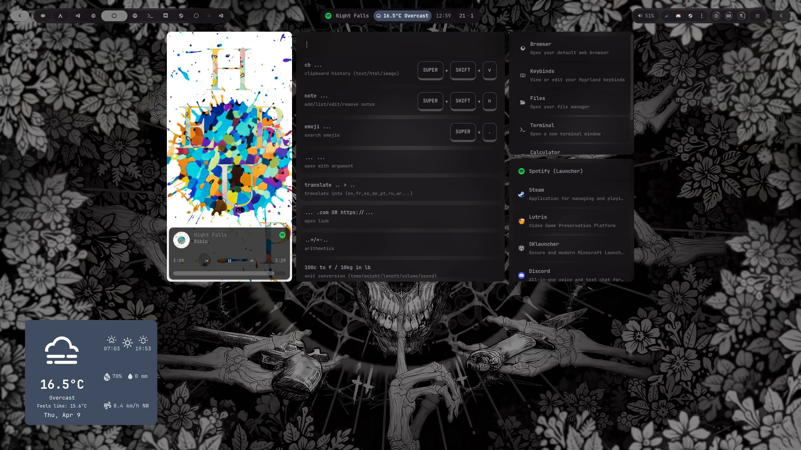
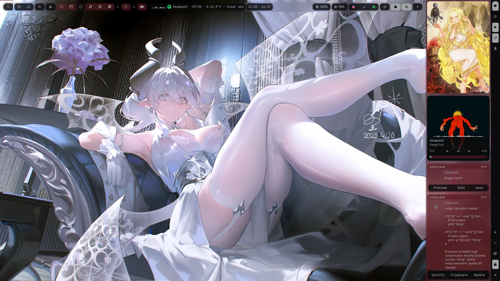
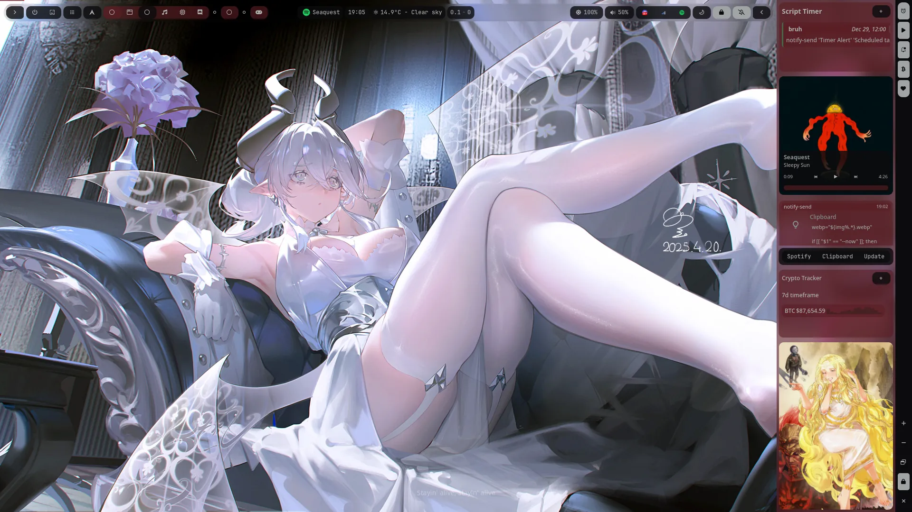
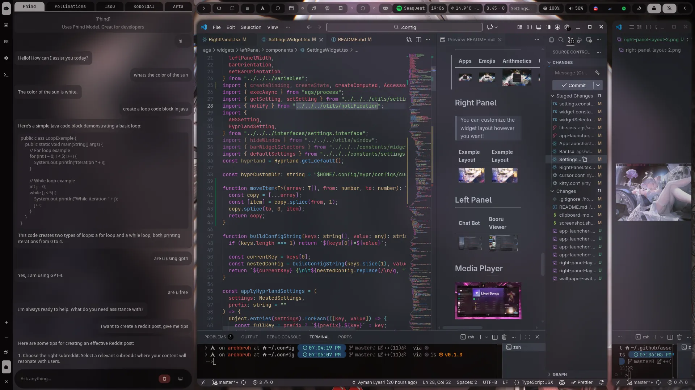
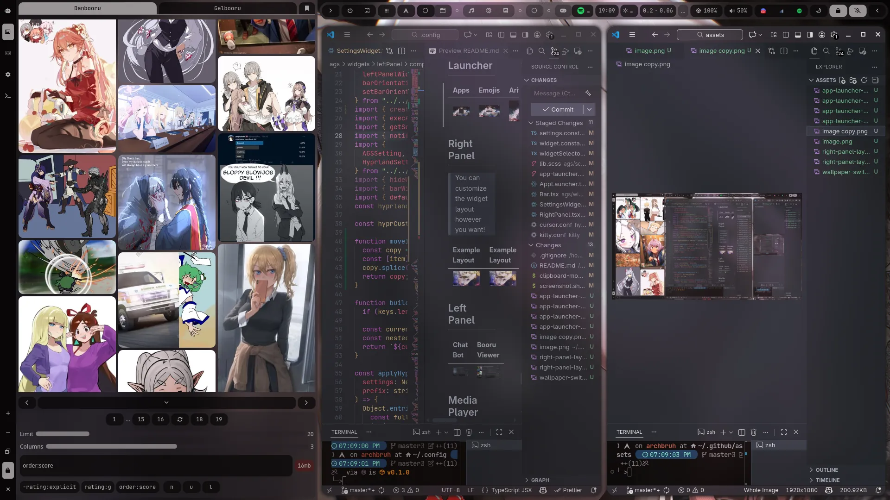
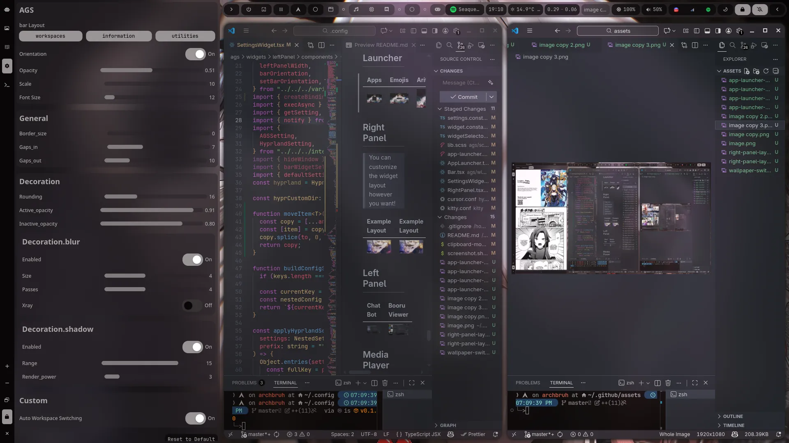
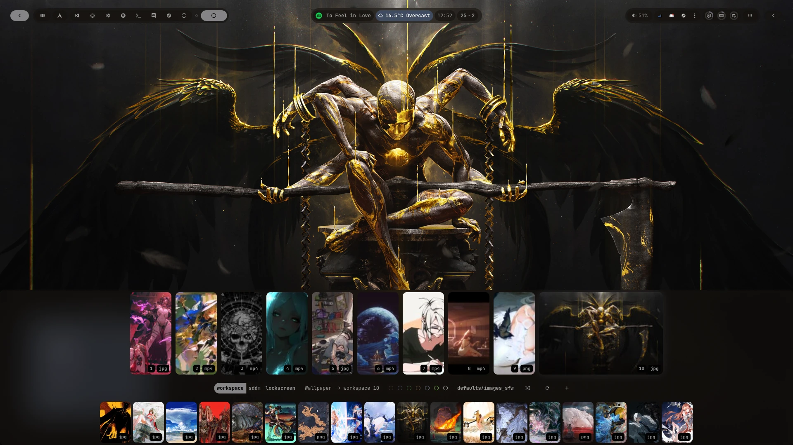
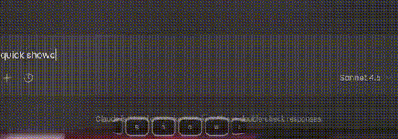
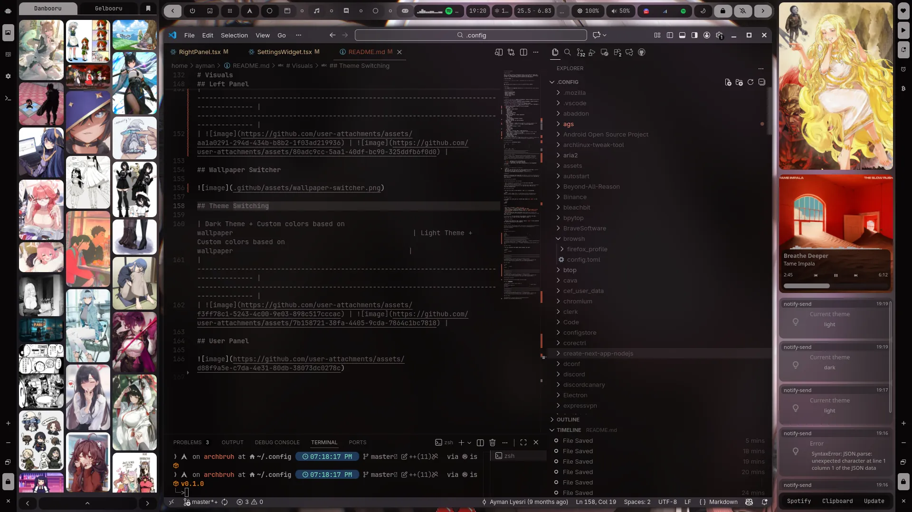

# **Arch Eclipse**

# Overview


# Description

This is my daily driver configuration that I use on both my laptop and desktop for coding, gaming, trading, browsing the web, etc., with Dvorak in mind. I am constantly adding new features and improvements.

I use Arch BTW.. :)

> **Feel free to open an issue ♡ (anything you can think of)!**

# Discord

Official [Discord](https://discord.gg/fMGt4vH6s5) server.

# Features

- **Dynamic wallpapers (static/animated)** based on each workspace: Custom scripts & [Hyprpaper](https://github.com/hyprwm/hyprpaper) / [Mpvpaper](https://github.com/GhostNaN/mpvpaper)
- **Dynamic color schemes** based on current wallpaper: Custom scripts & [PyWal](https://github.com/dylanaraps/pywal)
- **Global Theme switcher (Light/Dark)**: Custom scripts
- **Ags `GTK4-V3` widgets** ~~(Eww replaced & Ags `GTK3-V2` replaced)~~: _these are just some of the features_
  - Dynamic Color schemes based on current wallpaper `pywal`
  - Dark/light modes `pywal`
  - Main bar `switchable widgets`
    - Workspace Overview
    - Bandwidth speed monitor
    - Weather
    - Media Player
    - Tray System
    - Notification Popups
    - Crypto display
  - Application launcher ~~(Rofi replaced)~~
    - Clipboard History
    - App launcher
    - Emojis
    - Arithmetics
    - Url forwarding to default browser
    - Custom commands
  - Wallpaper switcher for each workspace (static/animated)
  - Keystroke Visualizer `optional`
  - Right Panel `optional & switchable widgets`
    - Waifu display -- using [Danbooru](https://danbooru.donmai.us) & [Gelbooru](https://gelbooru.com) APIs & Custom Images/Gifs
    - Media Player
    - Notification history
    - Calendar
    - Script Timer
    - Crypto Viewer
  - Left Panel
    - Chat Bot -- multiple APIs
    - Booru Viewer -- using [Danbooru](https://danbooru.donmai.us) & [Gelbooru](https://gelbooru.com) APIs
    - Manga Reader -- Using [MangaDex](https://mangadex.org/) API `WIP`
    - Hyprland/Ags settings
    - Custom Scripts
    - Keybinds display
  - User Panel (logout etc...)
- **High-quality wallpapers (static/animated)** from [Danbooru](https://danbooru.donmai.us), [Yandere](https://yande.re), & [Gelbooru](https://gelbooru.com)

# Current Workflow

> **Important:** Screenshots below ⊽

| W1  | W2      | W3  | W4                                                  | W5                                           | W6                                                  | W7                                                                            | W8  | W9  | W10   |
| --- | ------- | --- | --------------------------------------------------- | -------------------------------------------- | --------------------------------------------------- | ----------------------------------------------------------------------------- | --- | --- | ----- |
| --- | Browser | --- | [Spotify](https://wiki.archlinux.org/title/spotify) | [Btop](https://github.com/aristocratos/btop) | [Discord](https://wiki.archlinux.org/title/Discord) | [Steam](https://wiki.archlinux.org/title/steam)/[Lutris](https://lutris.net/) | --- | --- | Games |

- **W`id`**: Workspace with corresponding ID.
- **`---`**: Placeholder, any app can go here.
- **`name`**: Application that opens automatically in its designated workspace.

# To-Do List

- **Users: Any suggestions or issues?**
- Add tutorials for each part of the dot-files **(WIP)**
- Optimizing performance to squeeze more FPS out of games **(WIP)**
- Continuous improvements and polishing **(INDEFINITELY)**

# KeyBinds

KeyBinds are displayed and organized in the [Left Panel](#left-panel) or in form of text [Here](https://github.com/AymanLyesri/hyprland-conf/blob/master/.config/hypr/configs/keybinds.conf), be sure to check them out!

# Installation and Update

## Required Dependencies and packages

- [Arch Linux](https://archlinux.org/) (Other Arch-based distributions may work, with varying degrees of success)
- [Hyprland](https://hyprland.org/) (Make sure hyprland works properly before installing the dots)
- [Necessary packages](https://github.com/AymanLyesri/hyprland-conf/blob/master/.config/hypr/pacman/pkglist.txt) (do not worry they will be installed automatically)

## Installation Guide

> Run this one liner in the terminal

```bash
bash -c "$(curl -fsSL https://raw.githubusercontent.com/AymanLyesri/ArchEclipse/refs/heads/master/.config/hypr/maintenance/INSTALL.sh)"
```

## Update Guide

> To update the config and its related pkgs Simply run `archeclipse` in the terminal

```bash
archeclipse
```

# Tips

- User Icon is stored in `$HOME/.face.icon`
- Press `SUPER + w` to select the wallpaper you like
- Custom wallpapers should be added in `$HOME/.config/wallpapers/custom`
- Custom hyprland configuration should be put in `$HOME/.config/hypr/configs/custom`

> **Important**: If you encounter any problems, no matter how small, please feel free to open an issue. I’m happy to help! :)

# Additional Notes

- Machines with batteries (aka: laptops) require `upower` to be installed for battery monitoring to work properly.

<br><br>

<div align="center">

# ❤️ Support My Work

<a href="https://ko-fi.com/aymanlyesri">
  
</a>
<a href="https://www.buymeacoffee.com/aymanlyesri">
  
</a>
<a href="https://paypal.me/LyesriAyman">
  
</a>
<br>


<table>
<tr>
<td align="center">

**₿ Bitcoin**

```txt
1JisW9xeatCFadtgsenjbpCcFePZGPyXow
```

</td>
<td align="center">

**Ξ Ethereum / BSC**

```txt
0x52d06d47bb9dc75eaf027f18cb197d5817989a96
```

</td>
</tr>
</table>

⭐ Add a Star if you enjoy the project

</div>

<br><br>

# Star History

[](https://star-history.com/#aymanlyesri/hyprland-conf&Date)

# Visuals

## Application Launcher



## Right Panel

> You can customize the widget layout however you want!

| Example Layout                                    | Example Layout                                    |
| ------------------------------------------------- | ------------------------------------------------- |
|  |  |

## Left Panel

| Chat Bot                                        | Booru Viewer                                                                                    |
| ----------------------------------------------- | ----------------------------------------------------------------------------------------------- |
|  |   |

| Hyprland & Panel settings                        | KeyBinds Display                                 |
| ------------------------------------------------ | ------------------------------------------------ |
|  |  |

## Wallpaper Switcher



## Workspace OverView


## Keystroke Visualizer `optional`



## Theme Switching

| Dark Theme + Custom colors based on wallpaper | Light Theme + Custom colors based on wallpaper |
| --------------------------------------------- | ---------------------------------------------- |
|        |        |

## User Panel


